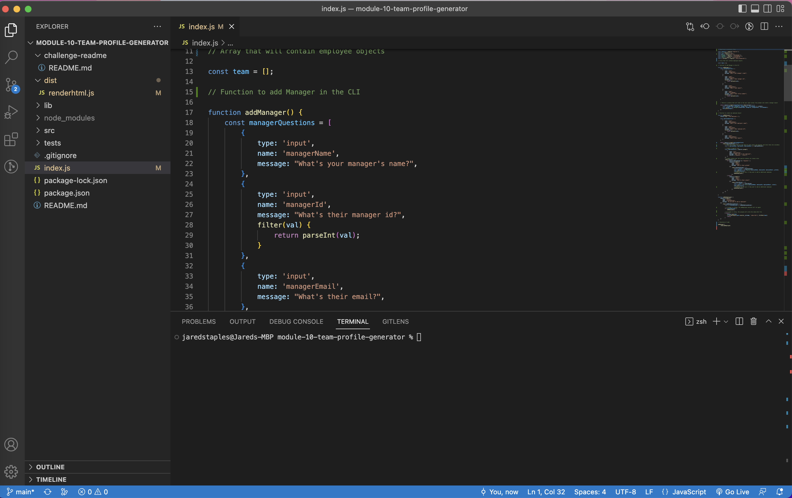

# Module-10-team-profile-generator 




## Description
This app takes in user input and generators an html file that renders employee information into cards. User information is collected using the Inquirer node package. Concepts applied to this project include:
- Object-Oriented-Programing
- Unit Tests
- Using Inquirer to take in user input
- Using npm package fs *(file system)* to dynamically create files

*Link to Walkthrough video:* [Walkthrough Video](https://drive.google.com/file/d/1SkrArv157E6mUKpqHvJ2gTzePAW-TAH2/view)

## Table of Contents

- [Installation](#installation)
- [Usage](#usage)
- [How to Contribute](#how-to-contribute)
- [Test](#test)
- [Questions](#questions)

## Installation
Open the command line and navigate to the folder containing the application. Download the node dependencies with 
```bash
npm install
```
 start the application with 
```bash
node index.js
```

## Usage
Answer the prompts to enter employee information and an html file will be created that renders the information.

## How to Contribute
N/A

## Test
N/A

## Questions
Github: https://www.github.com/jstaples50<br>
Email: jstaplesmusic@gmail.com

